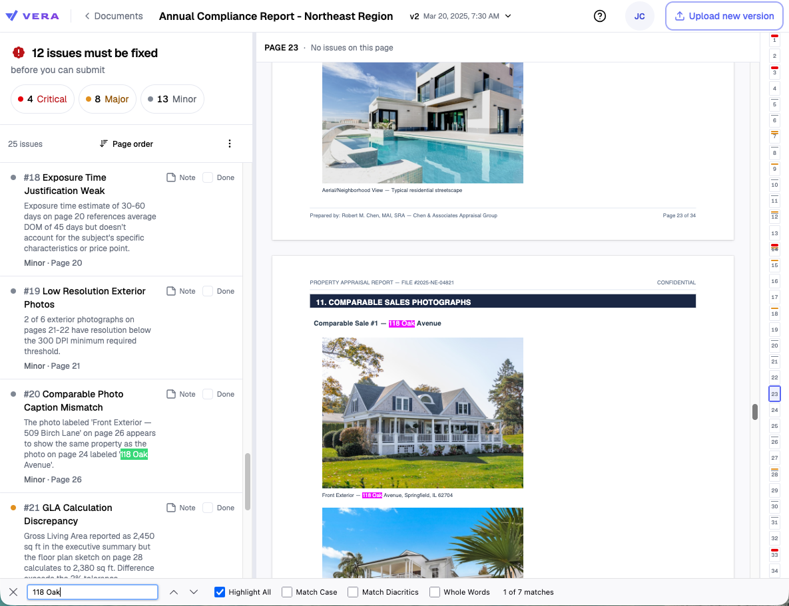
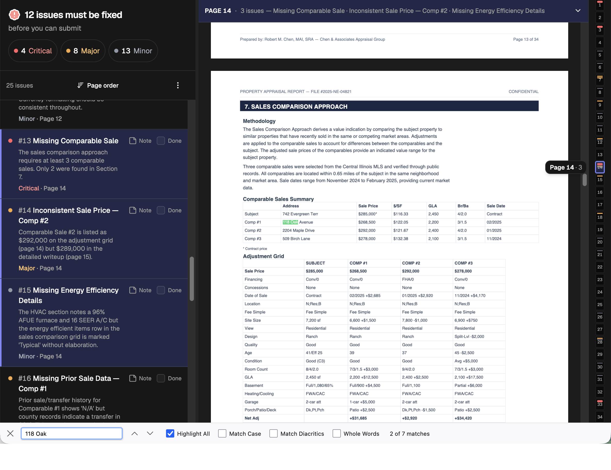
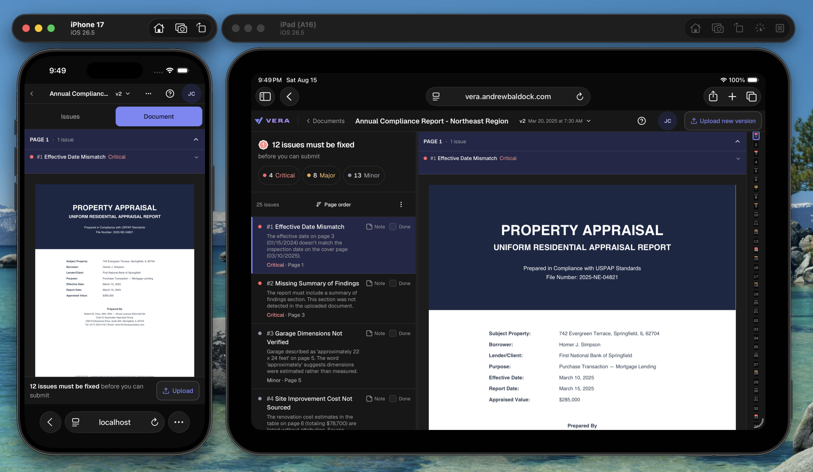
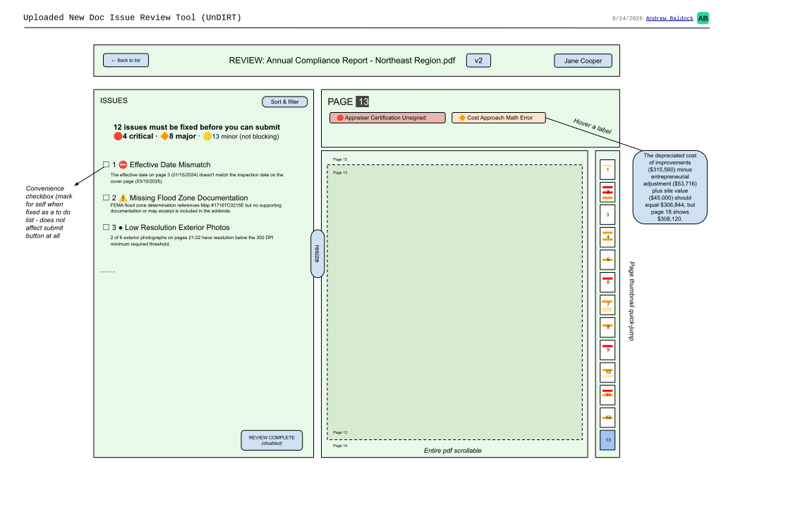

# VERA

*Latin* verus, *true. MIRA finds the problems; VERA is where a person decides.*

[](https://github.com/andrewbaldock/vera/actions/workflows/ci.yml)

### ▶︎ Live: **[vera.andrewbaldock.com](https://vera.andrewbaldock.com)**

Deployed so it can be opened on a real phone or iPad (try landscape mode!).

---

## The scenario

- A user uploads a PDF; the backend's AI processes it and reports issues that must be resolved
  before submission.
- **This demo app takes the API response** and presents the PDF alongside every issue found —
  Critical, Major, and Minor.
- The UI makes it easy to see how many issues there are and how many must be fixed before
  submission. Click or tap an issue and the PDF scrolls to the page it was found on. Any other
  issues on that same page are highlighted.
- On mobile, every feature works except one that belongs to desktop and landscape iPad: the
  **thumbnail bar**. Down the right edge is a scrollable, resizable strip of PDF page
  thumbnails that acts as navigation *and* heatmap — errors are marked on it, so clusters are
  easy to spot.
- The reviewer can leave notes on issues, and tick a checkbox to mark one done, which makes the
  app a **burndown assistant**.
- Submitting a review that meets the criteria shows a dialog confirming they really want to go
  ahead with minor issues accepted as-is, runs the submission, and returns them to the list to
  see their document settle in "success-blue" for a moment. (The demo is resettable, to clear
  the submitted state.)

Uploading and fixing are other screens in the brief's flow. This one decides whether the
document can go.





Whole-document **⌘F works**, which is why the viewer mounts every page's text layer. Both shots
are the same build; the theme is a user setting.



---

## Quickstart

Whether you cloned the repo or unzipped an archive, this is the whole of it.

**You need [Bun](https://bun.sh)**, one install, no Node required:

```sh
curl -fsSL https://bun.sh/install | bash
```

Then, from the project root:

```sh
bun install
bun run dev
```

Open **<http://localhost:1337>**. The port is pinned (`strictPort`), so if something else holds
it the server fails loudly instead of quietly moving. Works on mobile simulators.

### Everything you can run

| Command | What it does |
|---|---|
| `bun run dev` | Dev server with hot reload on port 1337 |
| `bun run build` | Typecheck **and** production build into `dist/` |
| `bun run preview` | Serve the production build locally |
| `bun test` | Unit tests for the product rules (vitest, ~0.2s) |
| `bun run test:layout` | Layout tests in real browsers (Playwright) |
| `bun run lint` | oxlint |
| `bun run test:watch` | The unit tests, re-running on change |
| `bun run test:layout:ui` | The layout suite in Playwright's UI mode, for stepping through a failure |

The layout suite needs its browsers once:

```sh
bunx playwright install chromium webkit
```

---

## Docs

| | |
|---|---|
| [`docs/DESIGN.md`](docs/DESIGN.md) | **Why** — scope, flow, every decision and what was rejected, ending in a decision log |
| [`docs/ARCHITECTURE.md`](docs/ARCHITECTURE.md) | **How** — layers and which way dependencies point, data flow, the single-writer rule, the viewer's internals, the token layer, the seams |
| [`docs/DEVELOPMENT.md`](docs/DEVELOPMENT.md) | How this was built, and what in it required knowing something that isn't obvious |
| [`docs/PRODUCTION.md`](docs/PRODUCTION.md) | What running this for real would take, and the work it deliberately does not touch |
| [`docs/wireframes/`](docs/wireframes/) | The UX sketches, drawn before implementation, and the two layout shapes at six sizes |
| [`RELEASES.md`](RELEASES.md) | What changed in each version |
| [`docs/assignment.pdf`](docs/assignment.pdf) | The original brief |

Read DESIGN.md to understand the product, ARCHITECTURE.md to understand the code. Neither
repeats the other.

### Routes

- `/documents` — the list, and where the app lands
- `/reviews/:id` — the review itself. The version is a query parameter, so
  `/reviews/souj5sd12c8a3f?v=3` is a link you can paste and reload
- `/demo` — the react-pdf harness that proves the viewer behaviors in isolation. Kept rather
  than deleted, and lazy-loaded so it costs regular visitors nothing
- `/dev` *(TBD)* — will allow uploading a different PDF and editing the mock API JSON, so other
  document-and-report combinations can be tested for fun

The running build names itself in the account menu and at
[`/version.json`](https://vera.andrewbaldock.com/version.json).

---

## How it began

Drawn in Google Drawings before the first component, to settle the layout on paper rather than
reverse-justify whatever the code ended up doing. Kept unedited where the build diverged, so
they still show what was intended before any code existed.
[Full size and the layout shapes](docs/wireframes/).



## How it's put together

```
src/
  lib/review.ts        the product rules as pure functions; canSubmit lives here
  types/review.ts      the payload shape, modeled from the mock
  hooks/useReview.ts   fetch + validate + loading/error/ready
  hooks/               done marks, notes, scroll tracking, theme, text size, panel
                       sizes — the reviewer's own layer, kept apart from the API's
  components/          the shell, the panels, the thumb strip, the splitter
  components/ui/       shadcn/ui source, copied in and owned here
tests/                 Playwright — layout, in real browsers
```

**Two layouts, one component tree.** The shape is decided entirely in CSS at 1024px: no
media-query hook, no branch, no second subtree to drift. Below that, one thing at a time with a
view switcher and a merged verdict/submit bar. Above it, the split view with a draggable
splitter and the thumb strip. A 13" iPad is 1024px wide *in portrait*, so the wide layout is a
touch layout that sometimes also has a cursor, and every control in it is built to that
standard.

**The thumb strip is resizable, and closes.** Drag its edge to make the page thumbnails bigger
and the strip scrolls to hold them; drag it shut and a pull tab brings it back. Where you leave
it is remembered.

## Testing

Two suites, because they answer different questions.

**`bun test` — the rules.** `canSubmit`, the severity counts, issue numbering that has to stay
attached to its issue when the list is re-sorted, and the payload guard. Pure functions, no
DOM, milliseconds. 32 tests.

**`bun run test:layout` — everything a browser has to answer, in Chromium and WebKit.** Nine
spec files, 244 tests:

| Spec | What it holds down |
|---|---|
| `layout` | Twelve real viewports from a 320px iPhone SE to 1920px — no horizontal overflow, the page itself never scrolls, each width renders the correct shape *and not the other one*, exactly one primary action visible and on screen, every touch target over 44px. Then a sweep from 320 to 1920 in 40px steps, because a fixed matrix sails past the 1007px disaster. |
| `viewer` | Every page's text layer mounted so browser find can reach the whole document, canvases actually windowed, clicking an issue scrolling the document, the page staying put when the window crosses the breakpoint, the end of the scroll reporting the last page, the phone path where the seek is made against a panel that has no layout yet, and both screens rendering on a browser with no `URL.parse` — the API a pdf.js dependency needs and Safari only shipped in 18.4. |
| `submit` | Both halves of the gate: blocked offers upload rather than a dead submit, open asks for confirmation naming what is being accepted, and a submitted review reads as submitted on a cold load. |
| `done` | The worklist reports progress without moving the gate, hides and shows its own rows, sinks under severity sort, and never crosses versions. |
| `documents` | The queue, the version switch surviving a reload, and the placeholders being inert. |
| `keyboard` | The issue grid driven entirely from the keyboard: arrows across all three columns, Enter seeking the document without moving the list, Space ticking Done. |
| `contrast` | Severity text and secondary text measured against every surface they sit on, in both themes, against the 4.5:1 AA floor. |
| `uiscale` | The three text sizes: each moves the root font size, the choice survives a reload and lands *before* the app mounts, junk in storage falls back, and the document does not scale with the interface. |
| `panels` | The splitter and the thumb strip: an untouched strip maps the whole document, a dragged one sizes pages from its width, it closes and reopens, and every size survives a reload. |

No screenshot baselines: WebKit and Chromium rasterize type differently, so baselines would
need a set each and would churn on every change. Structure is what's invariant.

**One caveat:** Playwright's WebKit is what Safari is built on, but it is not Safari, and its
mobile emulation will not reproduce `dvh` against the real toolbar, safe-area insets, or
momentum scrolling. Testing on the iOS Simulator, and on a real iOS device hooked up to
Safari's remote debugger, remains the mobile Safari truth.

**CI runs all of it on every push** — lint, types, the production build, both suites across
Chromium and WebKit — and deploys from `main` only if all of it passed.

## Accessibility

Treated as foundational and mandatory. It's a compliance tool in a regulated industry, used all
day, by people doing careful work.

- **Severity is never carried by color alone.** Rows pair the dot with a text label; in the
  thumb strip, where a narrow segment has no room for words, the marks differ in *thickness* as
  well as hue, so they survive grayscale.
- **Text size is a setting**, three stops in the account menu. It scales the interface and
  leaves the document alone, which browser zoom cannot do — zoom scales the pages you could
  already read along with the labels you couldn't.
- **The splitter is a real WAI-ARIA window splitter:** `role="separator"`, `aria-valuenow`,
  arrow keys and Home/End. Radix has no such primitive, so it's authored here to the system's
  own conventions rather than left as a mouse-only gap.
- **The thumb strip is a slider**, which follows from designing it for a thumb: one scrub
  control instead of 34 tap targets means `role="slider"`, `aria-valuetext`, arrow keys and
  Home/End come along with it. A control built for touch delivers keyboard navigation of the
  entire document.
- **Landmarks and a skip link.** `header`, a labeled issues region, `main` for the document,
  and a skip link so a keyboard user doesn't walk 25 issues to reach the document.
- **Nothing essential is behind `:hover`**, because the wide layout appears on touch screens.
  Hover is layered on top as an enhancement only.
- **Touch targets are 44px**, Apple's HIG number and also WCAG 2.1's AAA target size. WCAG 2.2's
  AA minimum is only 24px; exceeding it is a decision about a one-way submit with no undo. It is
  asserted in the layout suite rather than claimed.
- **Contrast is measured, not eyeballed.** The `contrast` spec walks every text token against
  every surface it lands on, in both themes, and fails under 4.5:1.

**The honest limitation:** a rendered PDF is not accessible. pdf.js paints to a canvas with a
selectable text layer over it, which is good enough for search and selection but not a
substitute for a tagged document. No client-side work fixes that; it belongs to whatever
produces the PDF. Stated plainly in [`docs/DESIGN.md`](docs/DESIGN.md) rather than glossed.

## Data

The API does not exist yet, so the app fetches a static mock over HTTP: a real async boundary
rather than a build-time import, so the loading and error states are honest.

- `public/review_mock.json` — the supplied mock response
- `public/docs/example_document.pdf` — the document it describes. The mock's `pdf_url` points at
  `example.com`; the app substitutes the local path at the boundary, so the fixture stays a
  faithful copy of what was supplied.

The payload is **validated, not asserted**. A cast is a promise; `isReview()` actually looks, so
a malformed response reaches the error state instead of dying inside a render.

## Installable, deliberately not standalone (PWA)

There's a web manifest and a full icon set, because this gets opened on a phone to be tested on
a phone, and without an `apple-touch-icon` iOS uses a *screenshot of the page* as the
home-screen icon.

It ships **`display: browser`**, not `standalone`. Standalone makes a PWA feel like an app by
removing the browser chrome, which is where iOS keeps **Find on Page**. Whole-document search is
an acceptance criterion, so the chrome is load-bearing. `apple-mobile-web-app-capable` is absent
for the same reason: on iOS it forces standalone regardless of the manifest.

No service worker. The app is one screen backed by a live review, and serving a stale verdict
offline would be worse than saying nothing.

## Dependencies

Every package I chose to add. Direct dependencies only: this is what's in `package.json`, not
the resolved tree. The list is short, and every line should be defensible.

### Runtime

| Package | Version | Why it's here |
|---|---|---|
| `react`, `react-dom` | ^19.2.8 | The framework. React 19 for the current baseline, no experimental APIs used. |
| `react-router` | ^8.3.0 | Two real routes and a standalone harness. A router rather than a hand-rolled `pushState`, for the same reason this uses shadcn over hand-rolled components: reach for the library when one exists. |
| `react-pdf` | ^10.4.1 | Thin, maintained React binding over Mozilla's pdf.js. Adds no rendering of its own; it saves writing the worker and text-layer glue, not the engine. |
| `pdfjs-dist` | 5.4.296 | The PDF engine. **Pinned exactly**, with no caret: the worker version must match what `react-pdf` loads or it throws at runtime. Declared rather than relied on via hoisting. |
| `tailwindcss`, `@tailwindcss/vite` | ^4.3.3 | Styling, and the token layer the whole theme rests on. |
| `radix-ui` | ^1.6.7 | Accessible behavior under the shadcn components: menus, focus management, dismissal. The part that is hard to write. |
| `lucide-react` | ^1.31.0 | Icons. Also, as it happens, the icon set HomeVision's own site uses. |
| `class-variance-authority` | ^0.7.1 | Typed component variants. Arrives with shadcn. |
| `clsx`, `tailwind-merge` | ^2.1.1 / ^3.6.0 | Conditional classes, with later Tailwind utilities correctly overriding earlier ones. The `cn()` helper. |
| `tw-animate-css` | ^1.4.0 | The animation utilities shadcn's generated components reference. |
| `@fontsource-variable/geist` | ^5.3.0 | The interface typeface, self-hosted so there is no third-party font request at runtime. |
| `@fontsource-variable/ubuntu-sans-mono` | ^5.3.0 | Notes only. A different face separates what the reviewer wrote from what the system found. |
| `@fontsource/goldman` | ^5.3.0 | The wordmark, and nothing else. Only the 700 weight is imported, since that is the only one the mark uses. |

### Development

| Package | Version | Why it's here |
|---|---|---|
| `vite` | ^8.2.0 | Build tool and dev server. |
| `@vitejs/plugin-react` | ^6.0.4 | React fast refresh and JSX transform. |
| `typescript` | ~6.0.2 | `strict`, with `noUnusedLocals` and `noUnusedParameters`. |
| `vitest` | ^4.1.10 | Unit tests for the rules. |
| `@playwright/test` | ^1.62.1 | Layout tests in real browsers, which is the only place layout can be tested. |
| `oxlint` | ^1.75.0 | Linting. Fast enough to run without thinking about it. |
| `shadcn` | ^4.18.0 | The CLI that copies component source into the repo. Not a runtime dependency; nothing imports it. |
| `@types/*` | — | Type definitions for React and Node. |

## Stack, and why

**Vite + React + TypeScript + Tailwind + shadcn/ui** (Radix underneath).

No SSR need for a post-upload page behind auth, so Vite rather than Next.js. I've shipped Vite
before.

The component library is a call rather than a default. This page has about ten controls and
browser-native accessibility covers most of them, but it is one screen of four in the brief's
own flow diagram, inside a product that will already have components to reach for. Deciding "no
library" from a ten-control sample is how component soup starts: every screen looks small enough
to hand-roll, and twenty screens later there are twenty slightly different buttons.

**shadcn** specifically, because it copies source into the repo rather than shipping a runtime
dependency: Radix supplies the hard behavior, the skin stays mine to edit, tokens are CSS
variables, and the registry keeps it re-syncable rather than a fork. This is how you start to
achieve UI harmony.

The splitter and the thumb strip are authored here, since Radix has no such primitives:
additions to the system following its conventions rather than gaps in it. Full reasoning and the
alternatives rejected are in [`docs/DESIGN.md`](docs/DESIGN.md).

## License

MIT — see [`LICENSE`](LICENSE).
