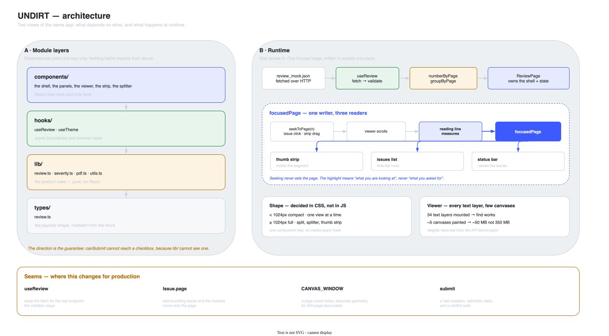

# VERA — Architecture

**How it works.** [`DESIGN.md`](DESIGN.md) is the record of *why* every decision was taken;
this is the map of what those decisions built. Where the two disagree, DESIGN.md is the
source of truth for intent and this file is wrong and should be fixed.



*Editable source: [`architecture/VERA_architecture.drawio`](architecture/VERA_architecture.drawio)*

---

## 1. The shape of it

Four layers, and dependencies point one way only.

```
components/     the two pages, the panels, the viewer, the strip, the splitter,
    │           the actions and dialogs. React lives here and only here.
    ▼
hooks/          useReview · useDoneIssues · useTheme
    │           async boundaries and browser state
    ▼
lib/            review    the product rules — pure, no React
    │           documents the demo catalog: one document, two versions
    │           submission persisted submissions, per review and version
    │           progress  the reviewer's done marks, same scoping
    │           severity  severity's colors and labels, as data
    │           session   who is signed in
    │           brand     the product name
    │           pdf       pdf.js worker configuration
    │           utils     cn()
    ▼
types/          review.ts
                the payload shape, modeled from the mock rather than the prose
```

**The direction is the guarantee, not a convention.** `canSubmit` lives in `lib/review.ts`,
which imports nothing but types. There is no path from a checkbox, a filter or any piece of UI
state into the gate, because the file that computes the gate cannot see them. That is stronger
than a code review promising the same thing.

The signature says it twice:

```ts
export function canSubmit(review: Review): boolean
```

It takes the **whole review**, never an array of issues. Handing it a filtered list is not a
mistake you can make; it is a type error.

## 2. Routing

Three routes and a spike, using React Router rather than a hand-rolled
`pushState`. Same rule that picked shadcn over hand-rolled components and
react-pdf over raw pdf.js: reach for the library when one exists.

| Route | What |
|---|---|
| `/documents` | The queue. Where the app lands, and where submitting returns you. |
| `/reviews/:documentId` | The review. `?v=3` selects the version. |
| `/demo` | The react-pdf spike, lazily loaded so its ~420 KB never reaches a normal visitor. |

**The version is a query parameter rather than component state** because it is a
different thing to look at, and different things deserve addresses: `?v=2` is a
link that survives a paste and a reload, and the back button stops lying about
where you are.

**`/documents` is a stub, not the Documents Page** from the spec's flow. It has
one live row, three inert placeholders and a reset control: the smallest surface
that gives the review somewhere to be opened from and returned to. Without it,
submitting is a one-way trip and an evaluator gets one attempt at the most
important interaction in the build.

Deployed as a static build on Vercel, where `vercel.json` carries the rewrite,
matching **only extensionless paths**, so a missing asset still 404s instead of
receiving `index.html` with a 200 and being parsed as JavaScript.

## 3. Data flow

```
public/review_mock.json
        │  fetched over HTTP, not imported — the async boundary is real,
        │  so loading and error states are honest rather than theater
        ▼
useReview()                  fetch → isReview() validates → discriminated union
        │                    { loading } | { error, message } | { ready, review }
        ▼
ReviewPage                   owns the shell and all shared state
        │
        ├── numberByPage()   stable numbering, returned in page order
        ├── sortIssues()     page order, or severity with done rows sunk
        ├── visibleIssues()  hidden severities and hidden done rows removed
        └── groupByPage()    issues keyed by page — computed on the UNFILTERED
                │            list, because the status bar and the strip describe
                │            the document, not the current view of it
                │
                ├── ReviewVerdict     takes `review`, never a list
                ├── IssuesPanel       takes the view of the issues
                ├── DocumentPanel     status bar + the viewer
                ├── ThumbStrip        the whole document as one scrub control
                └── ReviewAction      upload, submit, and the submit sequence

useDoneIssues(review)        the reviewer's private worklist, from localStorage
                             keyed by review id AND version
```

**Two hooks.** `useReview` is what the API says about the document;
`useDoneIssues` is what the person at the keyboard has ticked off. Keeping them
apart is what keeps `canSubmit` in a file that cannot see a checkbox, and it is
why hiding every severity, ticking every issue and sorting the list cannot move
the gate.

**Validation is at the boundary and nowhere else.** `isReview()` is ~20 hand-written lines
rather than a schema dependency. Once past it, every component downstream can trust its props
completely, and none of them carry defensive checks.

## 4. `focusedPage` — one writer, three readers

The single most important piece of state in the app.

```
seekToPage(n)         issue click · thumb strip drag · keyboard
      │
      ▼
viewer scrolls        smooth for a click, instant for a drag
      │
      ▼
reading line measures rAF-throttled, against the scroll container
      │
      ▼
focusedPage  ─────────┬─── thumb strip   marks the segment
                      ├─── issues list   tints the rows on that page
                      └─── status bar    names the issues on that page
```

**Seeking never sets the page.** It scrolls, and the measurement decides. That keeps the
highlight honest: it always means *"this is what you are looking at"*, never *"this is what
you asked for"*, and those two are different for the entire length of a smooth scroll.

Two consequences:

- **Measurement is suppressed during a programmatic scroll**, released on `scrollend` with a
  timeout fallback. Without it, a scroll to page 17 reports every page it passes and the list
  strobes on the way.
- **The reading line is a measurement, not an `IntersectionObserver`.** Observer callbacks
  fire only when a threshold is *crossed*, so distant pages keep reporting stale ratios and a
  page taller than the viewport never reaches the higher thresholds at all, which freezes the
  reading after one scroll.

## 5. Two layouts, one component tree

The shape is decided **entirely in CSS**, at 1024px.

```
< 1024px   compact   one view at a time behind a view switcher,
                     verdict and submit merged into one bottom bar
≥ 1024px   full      split view, draggable splitter, thumb strip,
                     metadata inline in the header
```

There is no `useMediaQuery`, no `isMobile` branch and no second subtree. Three things follow:

- **Nothing can drift.** Most codebases claiming "mobile-first" have two trees that diverge
  quietly over months.
- **No layout flash**, because there is no JS deciding anything at mount.
- **The layout suite can prove the shapes by resizing a single page**, which it does across
  twelve viewports and a 320→1920px sweep.

The mechanism is `max-lg:hidden` on the inactive view and `lg:w-[var(--issues-width)]` for
the splitter's width, with `--issues-width` set as an inline custom property so a JS number
can reach a CSS media query without JS knowing the breakpoint.

**1024 rather than 768** because the full shape carries two controls the compact one does
without, and both need room. It is a rule about the *window*, which is what makes iPad Split
View and Stage Manager come out right with no special case.

**The full shape is a touch layout.** A 13" iPad is 1024px wide *in portrait*, so it appears
under a finger before anyone rotates anything: Pointer Events throughout, 44px targets,
`touch-action: none` on drag surfaces, nothing essential behind `:hover`.

## 6. The viewer

The riskiest component, and the one that carries acceptance criterion #1.

| Concern | How |
|---|---|
| **Whole-document find** | Every page's text layer is mounted, always. Browser find only searches the DOM, so this is the price of using the platform's find rather than reimplementing it. |
| **Memory** | Canvases render only within `CANVAS_WINDOW` pages of the one being read. ~5 canvases instead of 34: roughly 50 MB instead of 350 MB, and iOS Safari discards tabs for less. |
| **Correct navigation** | Page wrapper heights are reserved from the API's `width`/`height` before pdf.js paints. Unreserved, the document is nearly zero pixels tall while loading and every scroll target lands in the wrong place. |
| **Which page** | The reading line, measured against the scroll container. |

**The text layer and the canvas are separable.** The text layer is what find needs and it is
only DOM spans. The canvas is what costs memory. Taking the phone seriously surfaced it, and it
made the desktop build better too, since mounting 34 canvases was never a good idea, merely
survivable.

**Everything measures against the scroll container, never the window.** The app has no window
scroll: the shell is `h-dvh overflow-hidden` and the layout suite asserts the document never
scrolls. Geometry taken from the viewport would be wrong by the height of the header plus the
status bar, and would look almost right.

The annotation layer is disabled. It makes PDF hyperlinks clickable, which this document does
not need, and it is the layer that ships `z-index: 3` and swallows clicks meant for the UI
above it.

## 7. The token layer

`src/index.css` holds the entire theme as CSS custom properties, including product
vocabulary rather than just chrome:

```css
--severity-critical  --severity-major  --severity-minor
--focus-tint         --focus-edge
```

**No component ever names a color.** `SeverityDot` maps a severity to a token class and
nothing else. A brand pass should be *this one file changing and the whole app re-skinning*.
If it ever requires touching a component, the token layer was wrong.

Dark is one class, `.dark`, applied by `useTheme`. The preference has three values
(system / light / dark) but there are only two palettes, so the resolving happens in JS and
CSS never has to know about the media query. That keeps a single definition of dark instead of
a class rule and a media query that can drift apart.

## 8. Testing

Two suites, two runners, because they answer different questions.

| | `bun run test` (vitest) | `bun run test:layout` (Playwright) |
|---|---|---|
| **Covers** | the rules and the payload guard | layout, shapes, touch targets, the viewer |
| **Where** | no DOM at all | real Chromium and WebKit |
| **Speed** | ~0.2s | ~25s |

**jsdom has no layout engine.** It will report that a 900px panel fits in a 320px window, so
the class of bug the layout suite exists to catch is the class jsdom cannot see. That is the
argument for a browser here, not a preference.

**No screenshot baselines.** WebKit and Chromium rasterize type differently, so baselines
would need a set per engine and would churn on every UI change. Structure is what is invariant
across both: no horizontal overflow, the right shape, exactly one visible submit button, 44px
targets.

The suite earned itself on first run by catching a 32px submit button, under the 44px minimum,
on the one control the whole page exists to gate.

## 9. Seams — where this changes for production

Named here so the answer to *"what would you do differently at scale"* points at code rather
than at good intentions. Fuller treatment in the production-readiness writeup.

| Seam | Today | At scale |
|---|---|---|
| `useReview` | fetches a static mock | swap the fetch for the real endpoint; `isReview()` stays exactly as it is |
| `Issue.page` | a page number, no coordinates | bounding boxes from the backend, and the markers move onto the page instead of into a status bar |
| `CANVAS_WINDOW` | a fixed page count | geometry against the viewport, once documents run to hundreds of pages |
| submit | writes to `localStorage`, then plays a fixed 2.7s sequence | a real mutation, with the sequence driven by the request rather than a timer, plus a failure path and a conflict path for a review that changed underneath you |
| `lib/session` | one constant | whatever auth returns. The distinction between *the signed-in user* and *the review's assigned user* already exists, which is what makes showing someone else's review possible |
| `lib/documents` | a hand-written catalog of one document | a documents endpoint, and this file becomes a fetch |
| `focusedPage` | React state | unchanged — the single-writer rule is what makes any of the above safe to add |

---

## Where to add things

- **A new product rule** → `lib/review.ts`, as a pure function, with a test beside it.
- **A new shared visual** → a token in `index.css` first, then a component that consumes it.
- **A new control** → check the touch requirements in [`DESIGN.md` §6d](DESIGN.md) before the
  visual design. The full layout is a touch layout.
- **Anything that moves the document** → route it through `seekToPage`. Never set
  `focusedPage` directly. That is the invariant the whole page rests on.
