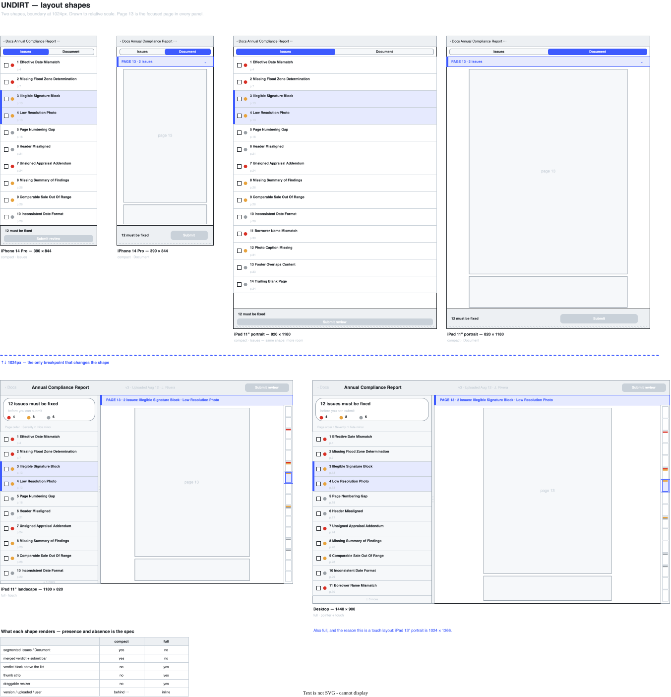

# Wireframes

Drawn in Google Drawings **before** the implementation, to settle the layout and the flow
rather than reverse-justify whatever the code ended up doing.

**Export:** [`VERA_wireframes.svg`](VERA_wireframes.svg)
**Source (live):** https://docs.google.com/drawings/d/1P1lXCZPaLolqYNq0aOk2XJNdWGl8UmqJt4W83rlUnVE/edit?usp=sharing

## Layout shapes

[`VERA_layouts.drawio`](VERA_layouts.drawio) — editable source, with [`VERA_layouts.svg`](VERA_layouts.svg) exported from it.

Six panels drawn **to relative scale**, so the shapes can be compared rather than described: iPhone and iPad-portrait in the compact shape (Issues and Document tabs each), iPad-landscape and desktop in the full shape. Page 13 is the focused page in every panel, which makes the contextual highlighting visible: the thumb strip marks it, the two issues on it highlight in the list, and the status bar names them.

The dashed line across the middle is **1024px, the only breakpoint that changes the shape**, and the table at the bottom is the presence/absence spec: what each shape renders and what it doesn't.

The final implementation may differ. The sketches record intent, not a spec.

## What the sketch establishes

- **Three regions:** header, issues list on the left, PDF viewer on the right, split by a
  draggable resizer.
- **The verdict leads.** *"12 issues must be fixed before you can submit"* sits above the
  list, with the severity breakdown beneath it. Acceptance criterion #3 is answered by the
  first thing you read, not by a caption next to a disabled button.
- **A status bar above the viewer** names the page in focus and the issues on it.
- **A thumb strip** down the right edge: one proportional rectangle per page, numbered,
  marked with a colored bar per issue on that page.
- **A checkbox per issue:** the user's private notepad, never an input to `canSubmit`.

Reasoning for each of these is in [`../DESIGN.md`](../DESIGN.md).
